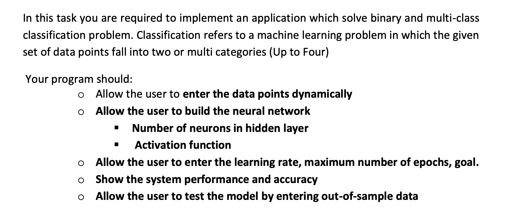
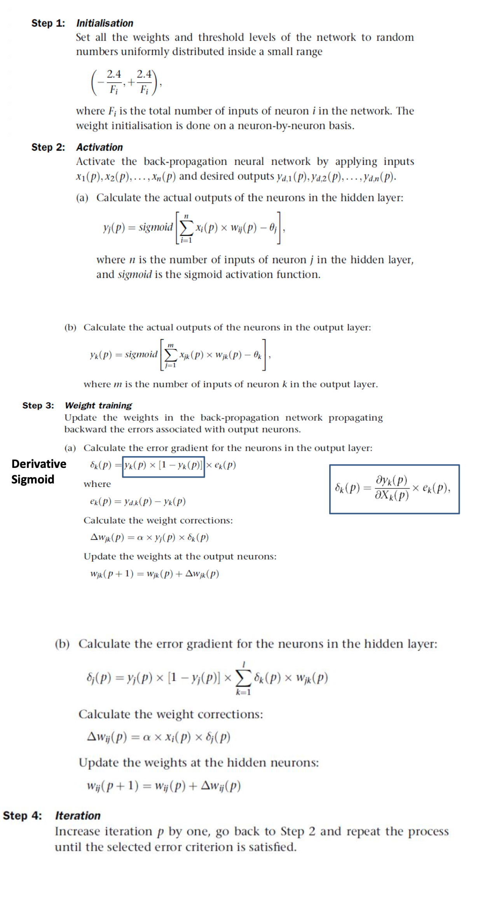
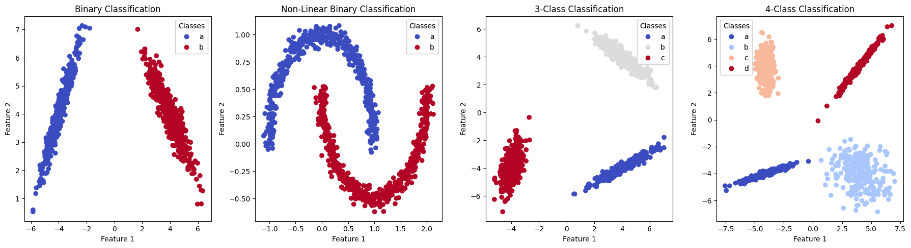

# AI Project 2 - Multi-Layer Neural Networks

This application enables you to construct Multi-Layer Neural Networks for the purpose of multi-class classification.

## Requirements



## Neural Network Strategy



The main difference is, in addition to the Sigmoid function, the hidden layers can utilize activation functions such as ReLU, Leaky ReLU, and Tanh. For multi-class classification, the output function can be Softmax.

## Sample Datasets



These datasets generated in Python using scikit-learn. [Here is the code used to do this](https://colab.research.google.com/drive/12ag2JvjJvO3cYyqMEH-y63PrahOOQwAM?usp=sharing).

## Usage

```bash
# Install dependencies
$ npm install

# Run the development server
$ npm run dev
```
